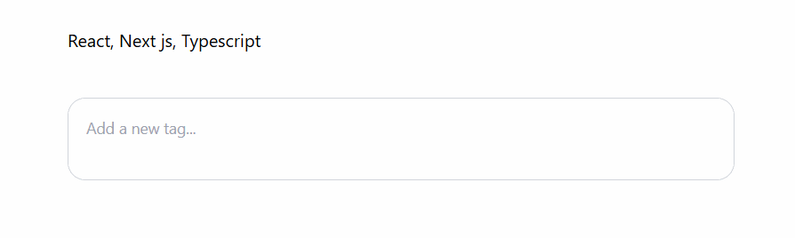
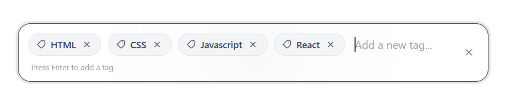
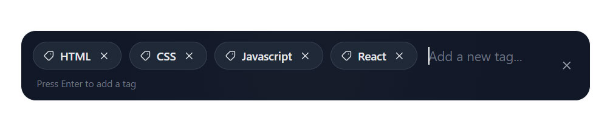
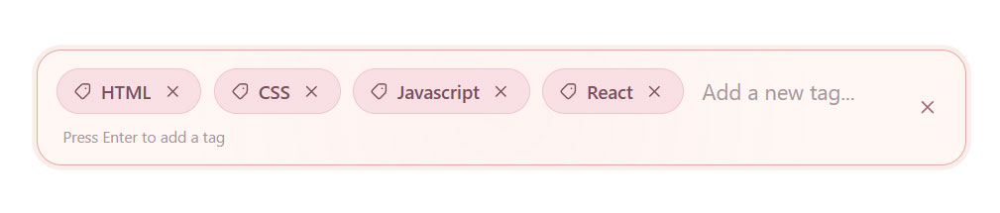
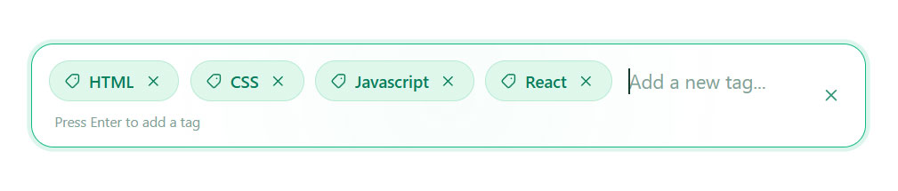
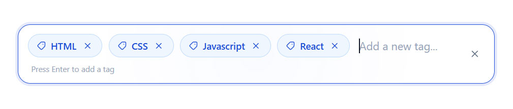
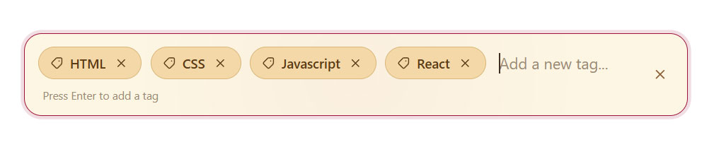
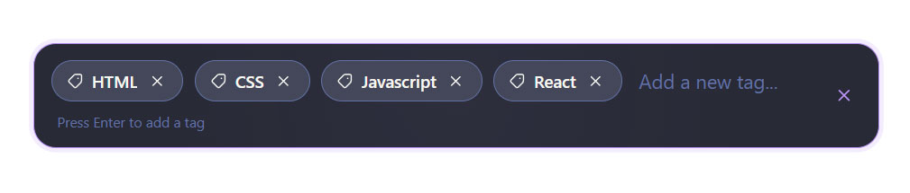

# taglite

**A lightweight, dependency-free React tag input with a focused API and flexible interactions.**

 

 

Type a tag, press Enter or comma, and keep going.

<code>taglite</code> is a controlled React component for collecting, validating, normalizing, and removing tags. It has zero runtime dependencies, ships with TypeScript types, and supports keyboard-first workflows without imposing an autocomplete or form framework.

## Why taglite?

- **Small by default** — zero runtime dependencies and no animation or icon libraries.
- **Controlled and predictable** — the parent owns the tag array through <code>value</code> and <code>onChange</code>.
- **Flexible input rules** — custom separators, duplicate handling, normalization, validation, limits, and paste parsing.
- **Ready for real interfaces** — built-in themes, RTL support, read-only and disabled states, native input attributes, and forwarded refs.
- **Easy to extend** — custom tag, remove, and clear icons plus lifecycle callbacks for additions, removals, invalid tags, and clearing.

## Built-in themes

The component includes eight theme values: <code>default</code> (a backward-compatible alias of <code>light</code>), <code>light</code>, <code>dark</code>, <code>cupcake</code>, <code>emerald</code>, <code>corporate</code>, <code>retro</code>, and <code>dracula</code>.

<table>
  <tr>
    <td align="center"><strong>Light</strong> </td>
    <td align="center"><strong>Dark</strong> </td>
  </tr>
  <tr>
    <td align="center"><strong>Cupcake</strong> </td>
    <td align="center"><strong>Emerald</strong> </td>
  </tr>
  <tr>
    <td align="center"><strong>Corporate</strong> </td>
    <td align="center"><strong>Retro</strong> </td>
  </tr>
  <tr>
    <td align="center"><strong>Dracula</strong> </td>
    <td align="center"><em>All themes use the same component API.</em></td>
  </tr>
</table>

## Installation

~~~bash
npm install taglite
~~~

Or use another package manager:

~~~bash
yarn add taglite
pnpm add taglite
~~~

<code>taglite</code> supports React <code>&gt;=18</code> and includes its own public TypeScript declarations.

## Quick start

~~~tsx
import { useState } from 'react'
import { SimpleTagInput } from 'taglite'
import 'taglite/style.css'

export default function Example() {
    const [tags, setTags] = useState<string[]>([])

    return (
        <SimpleTagInput
            value={tags}
            onChange={setTags}
            placeholder="Add a technology..."
        />
    )
}
~~~

The component is controlled through <code>value</code> and <code>onChange</code>; the tag array is never stored internally. The text currently being typed is temporary UI state managed by the component.

## Common interactions

### Add tags with the keyboard

By default, pressing <code>Enter</code> or <code>,</code> converts the current input into a tag. Empty values are ignored.

~~~tsx
<SimpleTagInput
    value={tags}
    onChange={setTags}
    separators={['Enter', ',']}
/>
~~~

~~~text
React + Enter  ->  React
Next.js + ,    ->  Next.js
~~~

### Paste multiple tags

Comma-separated, newline-separated, and mixed input can be pasted in one operation:

~~~text
React, Next.js
TypeScript, Tailwind CSS
~~~

~~~ts
['React', 'Next.js', 'TypeScript', 'Tailwind CSS']
~~~

The same processing pipeline applies to pasted values:

~~~text
normalize -> validate -> duplicate check -> maxTags -> onChange
~~~

### Combine features

~~~tsx
import { useState } from 'react'
import { SimpleTagInput } from 'taglite'

export default function Example() {
    const [tags, setTags] = useState<string[]>([])

    return (
        <SimpleTagInput
            value={tags}
            onChange={setTags}
            placeholder="Add a technology..."
            hintText="Enter, comma, or paste multiple tags"
            separators={['Enter', ',']}
            maxTags={8}
            allowDuplicates={false}
            normalizeTag={tag => tag.trim().toLowerCase()}
            validateTag={tag =>
                tag.length >= 2
                    ? true
                    : 'Tag must contain at least 2 characters'
            }
            onInvalidTag={(tag, reason) => {
                console.log('Invalid tag:', tag, reason)
            }}
            onTagAdd={(tag, index) => {
                console.log('Added:', tag, index)
            }}
            onTagRemove={(tag, index) => {
                console.log('Removed:', tag, index)
            }}
            acceptOnBlur
            clearable
            onClear={() => console.log('All tags cleared')}
            theme="dark"
        />
    )
}
~~~

## API reference

### Core props

| Prop | Type | Default | Description |
| --- | --- | --- | --- |
| <code>value</code> | <code>string[]</code> | required | Controlled tag list |
| <code>onChange</code> | <code>(tags: string[]) =&gt; void</code> | required | Called when tags change |
| <code>direction</code> | <code>'ltr' or 'rtl'</code> | <code>'ltr'</code> | Text direction |
| <code>theme</code> | <code>SimpleTagInputTheme</code> | <code>'light'</code> | Built-in visual theme |
| <code>accentColor</code> | <code>string</code> | — | Custom accent color while preserving the selected theme |
| <code>placeholder</code> | <code>string</code> | <code>'Add a new tag...'</code> | Input placeholder |
| <code>hintText</code> | <code>ReactNode</code> | <code>'Press Enter to add a tag'</code> | Focus helper text |
| <code>separators</code> | <code>string[]</code> | <code>['Enter', ',']</code> | Keys that create tags |
| <code>maxTags</code> | <code>number</code> | — | Maximum number of tags |
| <code>allowDuplicates</code> | <code>boolean</code> | <code>false</code> | Allow duplicate tags |
| <code>normalizeTag</code> | <code>(tag: string) =&gt; string</code> | — | Normalizes tags before validation |
| <code>validateTag</code> | <code>(tag: string) =&gt; boolean or string</code> | — | Validates tags |
| <code>onInvalidTag</code> | <code>(tag, reason?) =&gt; void</code> | — | Called for validation failures |
| <code>onTagAdd</code> | <code>(tag, index) =&gt; void</code> | — | Called after a tag is added |
| <code>onTagRemove</code> | <code>(tag, index) =&gt; void</code> | — | Called after a tag is removed |
| <code>acceptOnBlur</code> | <code>boolean</code> | <code>false</code> | Add current input on blur |
| <code>clearable</code> | <code>boolean</code> | <code>false</code> | Show clear-all button |
| <code>clearIcon</code> | <code>ReactNode</code> | built-in SVG | Custom clear icon |
| <code>onClear</code> | <code>() =&gt; void</code> | — | Called after clearing all tags |
| <code>tagIcon</code> | <code>ReactNode</code> | built-in SVG | Custom tag icon |
| <code>removeIcon</code> | <code>ReactNode</code> | built-in SVG | Custom remove icon |
| <code>removeButtonProps</code> | button attributes | — | Additional remove-button attributes |
| <code>readOnly</code> | native input prop | <code>false</code> | Prevent tag editing |
| <code>disabled</code> | native input prop | <code>false</code> | Disable interaction |
| <code>ref</code> | <code>Ref&lt;HTMLInputElement&gt;</code> | — | Ref to the native input |

<code>SimpleTagInput</code> also accepts standard <code>InputHTMLAttributes&lt;HTMLInputElement&gt;</code> props unless they conflict with the controlled <code>value</code> and tag-level <code>onChange</code> API.

### <code>value</code> and <code>onChange</code>

~~~ts
value: string[]
onChange: (tags: string[]) => void
~~~

<code>value</code> is the source of truth. <code>onChange</code> is called whenever the list changes, and the component does not mutate the existing array.

~~~tsx
const [tags, setTags] = useState<string[]>([
    'React',
    'Next.js',
])

<SimpleTagInput
    value={tags}
    onChange={setTags}
/>
~~~

### <code>direction</code>

~~~ts
direction?: 'ltr' | 'rtl'
~~~

Controls text direction. Use <code>rtl</code> for Persian, Arabic, Hebrew, and other right-to-left interfaces.

~~~tsx
<SimpleTagInput
    direction="rtl"
    value={tags}
    onChange={setTags}
/>
~~~

### <code>theme</code>

~~~ts
theme?:
    | 'default'
    | 'light'
    | 'dark'
    | 'cupcake'
    | 'emerald'
    | 'corporate'
    | 'retro'
    | 'dracula'
~~~

<code>default</code> is a backward-compatible alias of <code>light</code>. The default theme is <code>light</code>.

~~~tsx
<SimpleTagInput
    theme="dracula"
    value={tags}
    onChange={setTags}
/>
~~~

### <code>accentColor</code>

~~~ts
accentColor?: string
~~~

Sets a custom accent color for the component while preserving the selected theme as the base design.

The color is used to automatically derive related UI colors such as focus states, borders, tags, hover states, and action colors.

~~~tsx
<SimpleTagInput
    value={tags}
    onChange={setTags}
    accentColor="#7B61E8"
/>
~~~

You can use any valid CSS color value, including hex, RGB, RGBA, and HSL:

~~~tsx
<SimpleTagInput
    value={tags}
    onChange={setTags}
    accentColor="rgb(123, 97, 232)"
/>
~~~

`accentColor` can also be combined with any built-in theme. In this case, the selected theme remains the base design while `accentColor` overrides its accent colors.

~~~tsx
<SimpleTagInput
    value={tags}
    onChange={setTags}
    theme="dark"
    accentColor="#7B61E8"
/>
~~~

For example, the combination above uses the `dark` theme with a custom purple accent.

### <code>placeholder</code> and <code>hintText</code>

~~~ts
placeholder?: string
hintText?: ReactNode
~~~

The placeholder appears inside the input. <code>hintText</code> is rendered in the helper area while the component is focused.

~~~tsx
<SimpleTagInput
    placeholder="Add technology..."
    hintText="Press Enter or comma to add a tag"
    value={tags}
    onChange={setTags}
/>
~~~

<code>hintText</code> also accepts JSX:

~~~tsx
<SimpleTagInput
    hintText={Add your technology tags}
    value={tags}
    onChange={setTags}
/>
~~~

### <code>separators</code>

~~~ts
separators?: string[]
~~~

Defines which <code>KeyboardEvent.key</code> values create a tag. The default is <code>['Enter', ',']</code>.

~~~tsx
<SimpleTagInput separators={['Enter']} value={tags} onChange={setTags} />
<SimpleTagInput separators={['Enter', 'Tab']} value={tags} onChange={setTags} />
<SimpleTagInput separators={['Enter', ';']} value={tags} onChange={setTags} />
~~~

### <code>maxTags</code> and <code>allowDuplicates</code>

~~~ts
maxTags?: number
allowDuplicates?: boolean
~~~

<code>maxTags</code> ignores additional tags after the limit is reached; existing tags are never removed automatically. <code>allowDuplicates</code> defaults to <code>false</code> and controls whether an already-present tag can be added again.

~~~tsx
<SimpleTagInput
    value={tags}
    onChange={setTags}
    maxTags={5}
    allowDuplicates={false}
/>
~~~

With duplicates disabled, adding <code>React</code>, <code>React</code>, and <code>React</code> produces one tag. With <code>allowDuplicates</code> enabled, all three can be added.

### <code>normalizeTag</code>

~~~ts
normalizeTag?: (tag: string) => string
~~~

Transforms a tag before validation and duplicate checking. This is useful for trimming or normalizing case:

~~~tsx
<SimpleTagInput
    value={tags}
    onChange={setTags}
    normalizeTag={tag => tag.trim().toLowerCase()}
/>
~~~

Input <code>  REACT</code> becomes <code>react</code>. With <code>allowDuplicates={false}</code>, <code>React</code>, <code>react</code>, and <code>REACT</code> are treated as the same tag when using <code>tag =&gt; tag.toLowerCase()</code>.

### <code>validateTag</code> and <code>onInvalidTag</code>

~~~ts
validateTag?: (tag: string) => boolean | string
onInvalidTag?: (tag: string, reason?: string) => void
~~~

Validation runs after normalization. Return <code>true</code> to accept a tag, <code>false</code> to reject it without a reason, or a string to reject it and provide that reason.

~~~tsx
<SimpleTagInput
    value={tags}
    onChange={setTags}
    validateTag={tag =>
        tag.length >= 3
            ? true
            : 'Tag must contain at least 3 characters'
    }
    onInvalidTag={(tag, reason) => {
        console.log(tag, reason)
    }}
/>
~~~

### <code>onTagAdd</code> and <code>onTagRemove</code>

~~~ts
onTagAdd?: (tag: string, index: number) => void
onTagRemove?: (tag: string, index: number) => void
~~~

<code>onTagAdd</code> receives the final normalized tag and its resulting index. It is not called for empty, invalid, duplicate, or max-limit-rejected tags.

<code>onTagRemove</code> is triggered by clicking a tag's remove button or pressing Backspace while the input is empty. Its index is the tag's index before removal.

~~~tsx
<SimpleTagInput
    value={tags}
    onChange={setTags}
    onTagAdd={(tag, index) => console.log('Added:', tag, index)}
    onTagRemove={(tag, index) => console.log('Removed:', tag, index)}
/>
~~~

### <code>acceptOnBlur</code>

~~~ts
acceptOnBlur?: boolean
~~~

When enabled, the component attempts to add the current input when focus leaves it. The same normalization, validation, duplicate, and <code>maxTags</code> rules apply.

~~~tsx
<SimpleTagInput
    value={tags}
    onChange={setTags}
    acceptOnBlur
/>
~~~

### <code>clearable</code>, <code>onClear</code>, and <code>clearIcon</code>

~~~ts
clearable?: boolean
onClear?: () => void
clearIcon?: ReactNode
~~~

<code>clearable</code> shows a clear-all button when at least one tag exists. Clicking it calls <code>onChange([])</code> and then <code>onClear</code>, if provided. The clear action is disabled in read-only and disabled modes.

~~~tsx
<SimpleTagInput
    value={tags}
    onChange={setTags}
    clearable
    onClear={() => console.log('All tags cleared')}
    clearIcon={×}
/>
~~~

### <code>tagIcon</code> and <code>removeIcon</code>

~~~ts
tagIcon?: ReactNode
removeIcon?: ReactNode
~~~

Both props accept any React node. A runtime icon dependency is not required by <code>taglite</code>.

~~~tsx
<SimpleTagInput
    value={tags}
    onChange={setTags}
    tagIcon={#}
    removeIcon={×}
/>
~~~

You can also provide your own SVG:

~~~tsx
<SimpleTagInput
    value={tags}
    onChange={setTags}
    tagIcon={
        <svg viewBox="0 0 24 24" aria-hidden="true">
            {/* ... */}
        </svg>
    }
/>
~~~

### <code>removeButtonProps</code>

~~~ts
removeButtonProps?: {
    className?: string
    [key: string]: unknown
}
~~~

Adds attributes to the remove buttons rendered inside tags. <code>taglite</code> keeps control of the button type, click handler, disabled state, and core behavior.

~~~tsx
<SimpleTagInput
    value={tags}
    onChange={setTags}
    removeButtonProps={{
        title: 'Remove tag',
        className: 'text-red-500',
    }}
/>
~~~

## Read-only, disabled, and native input props

### <code>readOnly</code>

<code>readOnly</code> is inherited from native input attributes. In read-only mode, new tags cannot be added, existing tags cannot be removed, Backspace and blur do not modify tags, and clear-all is disabled. The input can still be focused.

~~~tsx
<SimpleTagInput value={tags} onChange={setTags} readOnly />
~~~

### <code>disabled</code>

In disabled mode, the input, tag actions, clear-all action, and keyboard tag actions are disabled. The component does not force focus onto the disabled input.

~~~tsx
<SimpleTagInput value={tags} onChange={setTags} disabled />
~~~

### Native input attributes

<code>SimpleTagInput</code> extends <code>InputHTMLAttributes&lt;HTMLInputElement&gt;</code>, so standard attributes are supported unless they conflict with the controlled tag API.

~~~tsx
<SimpleTagInput
    value={tags}
    onChange={setTags}
    name="tags"
    id="project-tags"
    autoComplete="off"
    autoFocus
    required
/>
~~~

The component intentionally controls <code>value</code> and <code>onChange</code> as its tag-list API.

## Forwarded ref

The component forwards its ref directly to the underlying native <code>&lt;input&gt;</code> element. This is useful for forms, dialogs, keyboard shortcuts, and programmatic focus management.

~~~tsx
import { useRef } from 'react'
import { SimpleTagInput } from 'taglite'

export default function Example() {
    const inputRef = useRef<HTMLInputElement>(null)

    return (
        <>
            <SimpleTagInput
                ref={inputRef}
                value={tags}
                onChange={setTags}
            />

            <button
                type="button"
                onClick={() => inputRef.current?.focus()}
            >
                Focus input
            </button>
        </>
    )
}
~~~

## Common patterns

### Technology tags

~~~tsx
<SimpleTagInput
    value={technologies}
    onChange={setTechnologies}
    placeholder="Add technology..."
    normalizeTag={tag => tag.trim()}
    maxTags={10}
/>
~~~

### Product keywords

~~~tsx
<SimpleTagInput
    value={keywords}
    onChange={setKeywords}
    placeholder="Add keyword..."
    allowDuplicates={false}
/>
~~~

### RTL / Persian

~~~tsx
<SimpleTagInput
    direction="rtl"
    theme="light"
    value={tags}
    onChange={setTags}
    placeholder="برچسب جدید..."
    hintText="برای افزودن برچسب Enter را بزنید"
/>
~~~

### Strict validation

~~~tsx
<SimpleTagInput
    value={tags}
    onChange={setTags}
    validateTag={tag =>
        /^[a-z0-9-]+$/i.test(tag)
            ? true
            : 'Only letters, numbers, and hyphens are allowed'
    }
/>
~~~

## Accessibility

The component uses native HTML controls and provides accessible labels for tag removal buttons. The default remove button receives a label based on the tag name, such as:

~~~text
Remove tag React
~~~

When replacing icons with custom React nodes, keep decorative icons <code>aria-hidden</code> when the icon itself does not provide information. For form-level labels, descriptions, and validation messages, use your application's surrounding form or field structure rather than duplicating field abstractions inside <code>SimpleTagInput</code>.

## TypeScript

The package exposes its public component and theme types:

~~~tsx
import {
    SimpleTagInput,
    type SimpleTagInputProps,
    type SimpleTagInputTheme,
} from 'taglite'
~~~

~~~ts
const theme: SimpleTagInputTheme = 'dracula'

const props: SimpleTagInputProps = {
    value: [],
    onChange: tags => {
        console.log(tags)
    },
    theme,
}
~~~

## Performance notes

<code>taglite</code> is designed to stay small and lightweight:

- no runtime dependencies
- inline SVG icons instead of an icon package
- controlled tag state managed by the parent
- memoized tag rendering
- cached theme styles
- simple array operations for normal add/remove flows
- no animation library
- no built-in network or asynchronous logic

For large tag collections, keep the <code>value</code> reference stable when the tags themselves have not changed.

## Development

Clone the repository, install dependencies, and start the Vite development server:

~~~bash
npm install
npm run dev
~~~

Available scripts:

| Command | Purpose |
| --- | --- |
| <code>npm run dev</code> | Start the Vite dev server with HMR |
| <code>npm run build</code> | Type-check and create the production app bundle |
| <code>npm run build:lib</code> | Build the distributable library and declaration files |
| <code>npm run lint</code> | Run ESLint across the repository |
| <code>npm run preview</code> | Preview the production build locally |

There is currently no automated test runner or <code>npm test</code> script. When behavior grows beyond manual verification, add focused component tests covering tag creation with Enter/comma, duplicate handling, removal, keyboard behavior, focus states, and each supported theme.

## License

MIT
